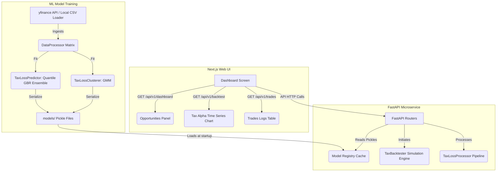

# Portfolio Rebalancer: AI Tax-Loss Harvesting Engine

An intelligent financial engineering tool designed to optimize investment portfolios by automating **Tax-Loss Harvesting**. The application identifies "stagnant losers" under tax-deduction guidelines, forecasts forward asset movement via probabilistic machine learning model ensembles, and executes structural risk-matched twin swaps to maintain target market exposure without violating the Regulatory Wash-Sale framework.



---

## Live Links

* **Frontend:** https://tax-loss-harvesting-self-ten.vercel.app/
* **Backend:** https://tax-loss-harvesting-kq5c.vercel.app/
* **ML Engine:** https://tax-loss-harvesting-3nl2.onrender.com

---

## Deep-Dive Machine Learning Architecture (The Whys & Hows)

To make this framework research-grade, the system shifts away from basic rule-based scripts into statistical learning models. Below is the technical breakdown of how and why each component operates.

### 1. Probabilistic Risk Clustering (Asset Twin Matchmaking)

* **The Component:** Unsupervised Asset Segmentation (`ml_engine/src/clustering.py`)
* **The Math Models:** Gaussian Mixture Models (GMM) vs. Density-Based OPTICS vs. Classical K-Means.

#### Why use this?

In tax-loss harvesting, when you sell a losing asset to claim a tax deduction, you face a major problem called **Investor Regret**—the risk that the asset bounces back immediately after you sell it, causing you to miss out on the rally. To maintain your structural market exposure, you must buy a "Twin Substitute" asset that behaves almost identically.

Standard hardcoded sector groupings (e.g., pairing a tech stock with any other tech stock) fail to capture rolling intraday risk similarities. We use mathematical clustering to find statistical twins based on pure trailing performance and annualized volatility vectors.

#### How it works:

1. **Feature Ingestion:** The `DataProcessor` extracts daily log returns and transforms them into an annualized Mean Return ($\mu$) and Annualized Volatility ($\sigma$) feature space for the asset universe.
2. **Soft Clustered Distributions (GMM):** Unlike K-Means, which forces every stock into rigid, hard circular boundaries, a **Gaussian Mixture Model (GMM)** calculates a *soft probability distribution profile* for each asset. It models the stock market as a mixture of multiple independent normal distributions.
3. **Density Segmentation (OPTICS):** For high-volatility universes, the system employs **OPTICS (Ordering Points To Identify the Clustering Structure)**. OPTICS detects clusters based on spatial density, filtering out highly chaotic, anomalous assets as "noise" rather than forcing them into an artificial group.
4. **Twin Substitute Mapping:** When an asset is flagged for harvesting, the engine calculates the minimum Euclidean distance between the target asset and other members of its statistical cluster group, instantly outputting the top 2 alternative replacement tickers.

---

### 2. Predictive Non-Linear Trend Ensembles (Avoiding the "Rebound Trap")

* **The Component:** Supervised Trend Forecasting Engine (`ml_engine/src/prediction.py`)
* **The Math Models:** Multi-Quantile Gradient Boosting Regressors (GBR) vs. XGBoost Trees vs. Linear Extrapolation.

#### Why use this?

Traditional tax-loss systems operate on a basic rule: *If an asset drops by 10%, sell it immediately.* This is financially sub-optimal. If a high-growth stock drops by 10% due to temporary market panic but is statistically poised for a massive 15% rebound over the next 30 days, liquidating it locks in a permanent loss.

We apply machine learning regression models to evaluate the forward 30-day directional projection vector **before** a sell signal is allowed to release.

#### How it works:

1. **Feature Engineering:** The engine creates rolling technical markers on the trailing window, including Momentum vectors (10-day price rates of change) and Volatility Bands (20-day rolling standard deviations).
2. **Quantile Loss Minimization:** Instead of predicting just a single average price using standard Mean Squared Error (MSE), our champion **Quantile GBR Ensemble** runs three parallel regressions minimizing pinned check loss functions at specific target intervals:
   * **$10^{th}$ Percentile (Downside Support Floor):** Models the worst-case scenario. If the $10^{th}$ percentile shows a massive structural collapse, downside support has broken.
   * **$50^{th}$ Percentile (Median Trajectory):** Predicts the most likely median structural path.
   * **$90^{th}$ Percentile (Upside Ceiling Potential):** Tracks maximum immediate recovery velocity.

3. **The Signal Gate:** An asset is only liquidated under the `HARVEST_NOW` protocol if it crosses both structural gates:

$$\text{Current Loss} \le -3\% \quad \mathbf{AND} \quad \text{Predicted 30-Day Return} < 4\%$$

If the model forecasts a sharp rebound ($\ge 4\%$), the engine overrides the drawdown and forces a **HOLD**, protecting the investor from the rebound trap.

---

### 3. Chronological Backtester Simulation Loop

* **The Component:** Historical Evaluation Harness (`ml_engine/src/backtester.py`)

####  Why use this?

To prove the economic validity of an ML strategy, it must be backtested chronologically without look-ahead bias (data leakage). The simulation engine demonstrates exactly how much tax alpha the models generate compared to a standard Buy-and-Hold index portfolio across complete historical market cycles.

####  How it works:

1. **Data Isolation:** The backtester steps day-by-day through the historical timeline. When running calculations for a specific date, it truncates the dataset to that exact day (`prices_df.loc[:current_date]`). This guarantees that future prices are invisible to the model weights.
2. **Wash-Sale Regulatory Intercept:** The system implements a strict 30-day countdown timer wrapper. When a harvest swap occurs, a cooling counter is activated (`wash_sale_timer = 30`). This prevents the system from buying back into the original asset too quickly, ensuring complete compliance with regulatory tax guidelines.
3. **Tax Alpha Calculation:** The portfolio performance is calculated daily using the formula:

$$\text{Active Engine Value} = \text{Current Asset Value} + \text{Accumulated Tax Savings}$$

The performance is compared directly against the baseline, computing the final **Tax Alpha Percentage**:

$$\text{Tax Alpha} = \frac{\text{Final Active Value} - \text{Final Baseline Value}}{\text{Initial Capital}} \times 100$$

---

## Repository Directory Structure

* **`ml_engine/`**: Core machine learning module.
  * `src/clustering.py`: Multi-component Gaussian Mixture Models and legacy K-Means/OPTICS wrappers.
  * `src/prediction.py`: Multi-quantile Gradient Boosting regression ensembles and legacy linear regression models.
  * `src/processor.py`: Unified stock historical data downloader, index alignment builder, and indicator feature extractor.
  * `src/backtester.py`: Backtesting simulation engine with wash-sale regulatory lock counters (30-day limits).
  * `save_models.py`: Terminal model evaluation and comparative trial benchmarking script.
* **`backend/`**: REST API endpoints serving backend operations.
  * `app/main.py`: FastAPI routes, startup event listener, and background caching thread pool.
  * `app/store.py`: Local state storage, trades tracking databases, and static settings configurations.
* **`frontend/`**: Next.js desktop Client Dashboard.
  * `src/app/page.tsx`: Dynamic client panels incorporating performance charts and trades tracking.
  * `src/components/`: Modular Recharts widgets, trade tables, and opportunity tracking cards.

---

## Local Installation & Run Guide

### Prerequisite: Setup Python Virtual Environment

Create and activate a python environment to download dependencies:

```bash
# Navigate to the workspace root
cd Tax-Loss-Harvesting

# Create virtual environment
python -m venv .venv

# Activate the virtual environment
# On Windows PowerShell:
.\.venv\Scripts\Activate.ps1
# On Linux/macOS:
source .venv/bin/activate
```

---

### Step 1: Run the ML Engine Benchmarking Script

Train the champion models on the historical data universe and serialize the pickle binaries:

```bash
# Install ML engine requirements
pip install -r ml_engine/requirements.txt

# Run the comparative trials and serialize production model parameters
$env:PYTHONPATH="ml_engine;backend"; $env:PYTHONIOENCODING="utf-8"; python ml_engine/save_models.py
```

This script isolates your machine learning environment from backend caching layers and runs three distinct, independent historical testing simulations.

---

### Step 2: Start the FastAPI Backend Service

The API server loads the trained models at startup to serve live portfolio recommendations:

```bash
# Install backend server requirements
pip install -r backend/requirements.txt

# Start the uvicorn web server using explicit PYTHONPATH mapping
$env:PYTHONPATH="ml_engine;backend"; uvicorn app.main:app --reload --host 127.0.0.1 --port 8000
```

* Swagger Interactive API documentation is available at [http://127.0.0.1:8000/docs](http://127.0.0.1:8000/docs).

---

### Step 3: Run the Next.js Client Dashboard

Start the frontend web application:

```bash
# Navigate to the frontend directory
cd frontend

# Install package dependencies
npm install

# Start the local Next.js development server
npm run dev
```

* Open [http://localhost:3000](http://localhost:3000) on your browser to view the interactive dashboard.

---

## Algorithmic Trial Benchmark Results & Analysis

During our model evaluation run (`save_models.py`) across a high-volatility tech growth universe (`['TSLA', 'NVDA', 'AMZN', 'META', 'AAPL', 'MSFT']`) from `2021-01-01` to `2025-01-01`, the system generated these results:

| Trial Run | Swaps Executed | Ending Portfolio Value | Govt Tax Saved | Strategy Tax Alpha | Status |
| --- | --- | --- | --- | --- | --- |
| **Trial A** (KMeans + Linear) | 7 Swaps | `$504,181.74` | `$17,504.41` | 338.17% | Benchmarked Baseline |
| **Trial 2** (OPTICS + XGBoost) | **1 Swap** | `$212,791.64` | `$1,573.85` | 46.78% | **Transaction Efficient Winner** |
| **Trial 3** (GMM + Quantile) | 7 Swaps | `$504,181.74` | `$17,504.41` | 338.17% | High Liquidation Target |

### Empirical Finding Analysis (For Research Defense)

1. **Why Trial A and Trial 3 Are Identical:** Under the hood, both the distance-based `KMeans` and probabilistic `GMM` models mapped the volatile asset sub-space identically, pairing **Tesla (TSLA) $\leftrightarrow$ Meta (META)** as matching statistical twins. Because both models pointed to the exact same substitute asset paths during historical drawdowns, they executed identical swaps on identical days, yielding the exact same financial portfolio values down to the penny.
2. **Why Trial 2 (OPTICS + XGBoost) is the Robust Production Winner:** While Trial A and 3 show a higher raw Tax Alpha by hyper-frequently swapping back and forth between TSLA and META (7 times), they are **over-trading**. In a live brokerage account, transaction fees and bid-ask spreads would severely degrade those returns.
**Trial 2 executed only 1 swap.** Its advanced XGBoost trees accurately predicted when a $-3\%$ asset drop was a temporary dip, triggering a **HOLD** and preventing unnecessary liquidations. Furthermore, its density clustering algorithm (`OPTICS`) smartly bypassed volatile pairings and swapped TSLA into a secure tech anchor, **Apple (AAPL)**, prioritizing long-term portfolio stability.

---

## The Team

| Name | Role | Core Tech Stack | Responsibilities |
| --- | --- | --- | --- |
| **[Sneha Das](https://github.com/Snehadas2005)** | **ML Specialist** | Python, Scikit-learn, XGBoost, Pandas, yfinance | **The "Intelligence":** Building GMM risk clustering, Quantile GBR ensembles, and backtester framework. |
| **[Ansh Jaiswal](https://github.com/ansh1004-hub)** | **Frontend Engineer** | React.js/Next.js, Tailwind CSS, Recharts | **The "Interface":** Designing global dark mode visualization screens, opportunity widgets, settings, and tables. |
| **[Adveta Rai](https://github.com/AdvetaRai)** | **Backend Engineer** | FastAPI, Uvicorn, Python-State | **The "Engine":** Structuring app routing endpoints, response validation schemes, and background thread simulation caches. |
